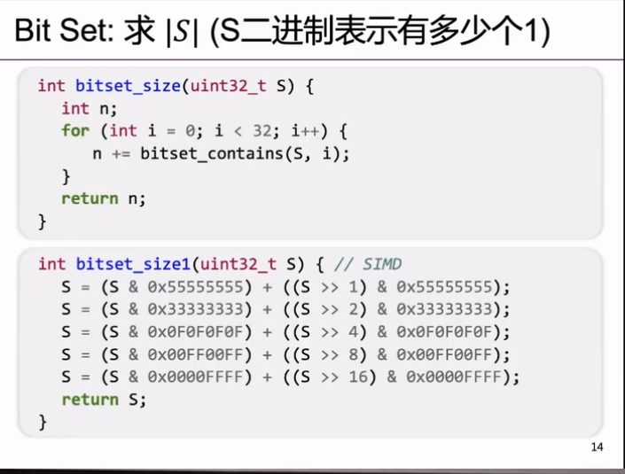
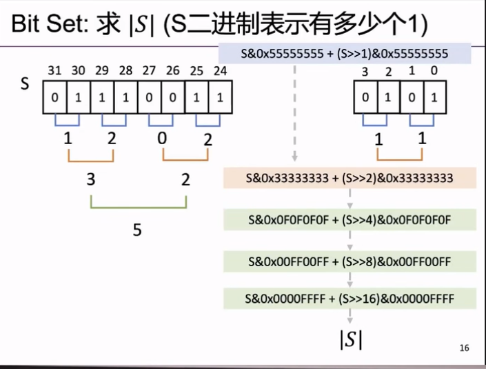
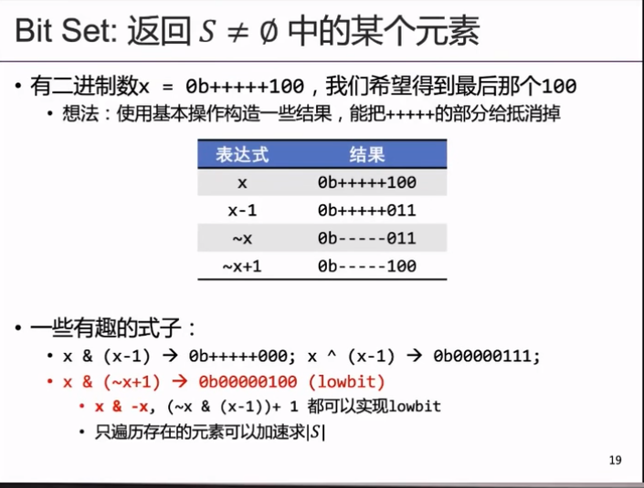

### 宏定义函数
```c
#define assert(cond) if(!cond) panic(...);
```
```c
if (...) assert(0);
else ...

展开后else会匹配到if(!cond)!!!!而不是if(...)

```
***宏定义不打括号的代价***
```c
#define assert(cond) \
    do { \
      if (!(cond)) { \
        printf("Assertion fail at %s:%d\n", __FILE__, __LINE__); \
        halt(1); \
      } \
    } while (0)
```

### simd 



### lowbit
